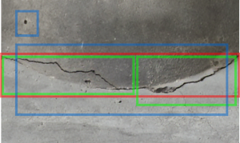
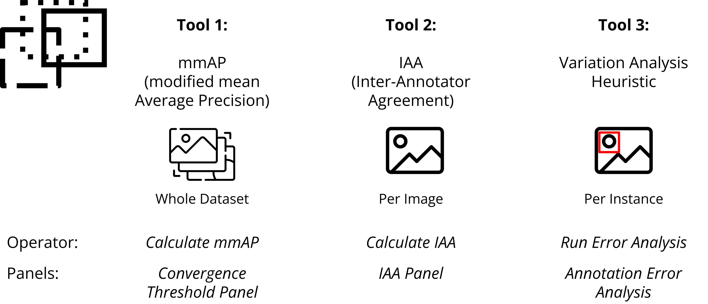

# Multi Annotator Toolkit

This is a plugin for the [FiftyOne framework](https://github.com/voxel51/fiftyone) that allows analysis of multi-annotated data. It is associated with our WACV publication [1](#1) looking into Label Convergence in Object Recognition as well as analysis of annotation errors/variations.

<p align="center">
  
</p>

<p align="center" style="font-size: 0.9em;">
  <em>Example of noisy annotation on a concrete structure, annotated by multiple civil engineers. Different colors indicate different annotators.</em>
</p>

## Contents

- [Disclaimer](#disclaimer)
- [What can be done with this plugin](#what-can-be-done-with-this-plugin)
- [Examples](#examples)
- [Installation](#installation)
- [Hello World](#multi-annotator-toolkit-hello-world-using-lvis)
- [Add own dataset](#adding-your-own-dataset)
- [Reference](#reference)

## Disclaimer

**The plugin is still under development, at this point only the basic feature are working and have not been tested on 
any additional datasets besides LVIS.**

## What can be done with this plugin



The plugin currently provides multiple functionalities to analyze dataset on three different levels - the whole dataset,
entire images or on a per-class basis.

## Examples

https://github.com/user-attachments/assets/5e310934-7518-429f-b850-424f4476cd9c

This example shows a user running the per-instance based error-analysis and selecting to visualize a specific variation-type. The stacked histograms show the error distribution for specific localization qualities and tasks.

https://github.com/user-attachments/assets/8b65fbc2-35be-4833-90f7-5549dc62c3bb

Another example showing a user running the inter-annotator-calculation and afterwards visualizing images with bad agreement to inspect them. The hisgram can be set to different localization thresholds and tasks.

## Installation

Install fiftyone [as described](https://github.com/voxel51/fiftyone) on the official website. 

Install this plugin:
```
fiftyone plugins download https://github.com/Madave94/multi-annotator-toolkit
```
Check if plugin is installed:
```
fiftyone plugins list
```
Install plugin dependencies as described in [requirements.txt](requirements.txt) using auto-install:
```
fiftyone plugins requirements @madave94/multi_annotator_toolkit --install
```

## Multi-Annotator-Toolkit Hello World using LVIS

1. Download the consistency annotations here:
[https://github.com/Madave94/LVIS-Double-Annotations/tree/master/processed_double_annos_v1.0](https://github.com/Madave94/LVIS-Double-Annotations/tree/master/processed_double_annos_v1.0)  
`wget https://github.com/Madave94/LVIS-Double-Annotations/blob/master/processed_double_annos_v1.0/lvis_v1.0_val_doubly_annos_subset200.json`  

2. Download the necessary LVIS images using [COCO 2017 Val images](https://cocodataset.org/#download):  
`wget http://images.cocodataset.org/zips/val2017.zip`

3. Unpack LVIS images and put them together in a folder with the annotations.

5. Copy this example into a jupyter-notebook, **change the data_root variable** and run it:

```
import fiftyone as fo
import fiftyone.operators as foo
print(fo.list_datasets())
name = "LVIS-Multi-Annoated-Subset"
if fo.dataset_exists(name):
    fo.delete_dataset(name)

data_root = "/path/to/downloaded/folder/" # <---- change this
labels_path = data_root + "lvis_v1.0_val_doubly_annos_subset200.json"
dataset = fo.Dataset.from_dir(
    dataset_type=fo.types.COCODetectionDataset,
    data_path=data_root + "images",
    labels_path=labels_path,
    name = name,
    extra_attrs = True,
    use_polylines =True
)

# Loads the multi-annotated data
load_multi_annotated_data = foo.get_operator("@madave94/multi_annotator_toolkit/load_multi_annotated_data")
await load_multi_annotated_data(dataset, labels_path)

# calculates inter-annotat agreement for object detection (bounding box) and instance segmentation (polygon)
calculate_iaa = foo.get_operator("@madave94/multi_annotator_toolkit/calculate_iaa")
await calculate_iaa(dataset, "bounding box", [0.3, 0.4], run_sampling=True)
await calculate_iaa(dataset, "polygon", [0.7, 0.8], run_sampling=True, subset_n=100, sampling_k=50, random_seed_s=50)

# calculates mmAP for object detection (bounding box) and instance segmentation (polygon)
calculate_mmap = foo.get_operator("@madave94/multi_annotator_toolkit/calculate_mmap")
await calculate_mmap(dataset, "bounding box", [0.5, 0.55, 0.6, 0.65, 0.7, 0.75, 0.8, 0.86, 0.9, 0.95], dataset_scope="Partial", sampling_k=10)
await calculate_mmap(dataset, "polygon", [0.4, 0.45, 0.5, 0.55], dataset_scope="Partial", sampling_k=15)

# runs error analysis
run_error_analysis = foo.get_operator("@madave94/multi_annotator_toolkit/run_error_analysis")
await run_error_analysis(dataset, "bounding box", [0.6, 0.7])
await run_error_analysis(dataset, "polygon", [0.4, 0.5])

session = fo.launch_app(dataset, auto=False)
```

Ensure to change the path to the downloaded and unpacked folder. This example will load the multi-annotated and run a
inter-annotator-agreement calculation.

## Adding your own Dataset

Coming soon.. for now please request the description from [David Tschirschwitz via e-mail](mailto:david.tschirschwitz@uni-weimar.de).

## Reference

<a id="1">[1]</a> Tschirschwitz David and Rodehorst Volker . "Label Convergence: Defining an Upper Performance Bound in 
Object Recognition through Contradictory Annotations" _Proceedings of the IEEE/CVF Winter Conference on Applications of 
Computer Vision (WACV)_. 2025. [Link](https://arxiv.org/abs/2409.09412)
